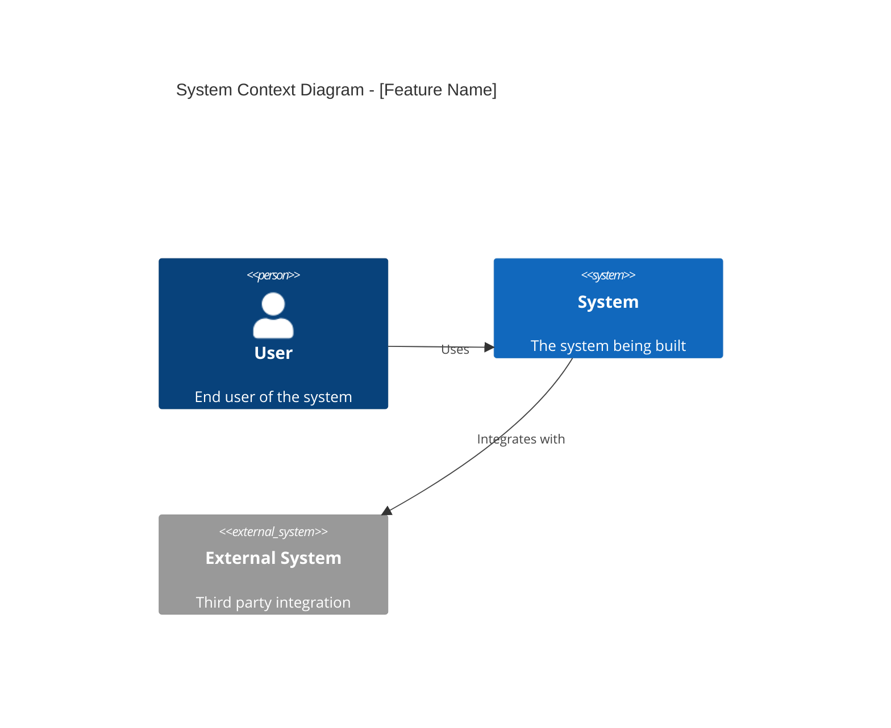
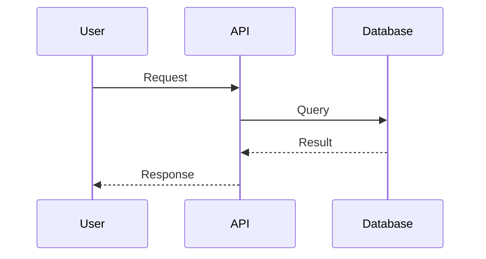

# PRP: TDD E2E & Architecture Documentation Evolution

**Version:** 1.0.0
**Date:** 2026-01-08
**Status:** Ready for Implementation

---

## Discovery Summary

### Initial Task Analysis

Evolve CC Blueprint Toolkit to automatically generate E2E tests using TDD methodology and comprehensive architectural documentation during the `execute-prp` workflow. This transforms the toolkit from a planning tool into a complete "state of the art" development companion.

### User Clarifications Received

- **Question**: What stacks should be supported?
- **Answer**: Backend Node (Supertest+Jest), Mobile React Native (Detox), Frontend Web (Playwright), Backend Python (pytest+httpx), Golang (go test), Full-Stack (Playwright)
- **Impact**: Need stack-specific agents and templates

- **Question**: When should documentation be generated?
- **Answer**: During execute-prp, after implementation
- **Impact**: Documentation reflects actual implementation, not planned architecture

- **Question**: What documentation artifacts are essential?
- **Answer**: ADRs, C4 Diagrams, API Docs, Data Flow, ERD, Sequence Diagrams
- **Impact**: 6 distinct documentation generators needed

- **Question**: What diagram format?
- **Answer**: Mermaid (GitHub-native, versionable)
- **Impact**: All diagrams in Mermaid syntax

### Missing Requirements Identified

- Stack detection logic to auto-select appropriate test framework
- Template system for each documentation type
- Integration with existing execute-prp command

---

## Goal

Transform the CC Blueprint Toolkit's `execute-prp` command to implement a pure TDD E2E workflow (Red → Green → Refactor → Document) that:

1. **Generates failing E2E tests FIRST** based on PRP acceptance criteria
2. **Implements code** until tests pass
3. **Refactors** while maintaining passing tests
4. **Generates comprehensive architectural documentation** reflecting the actual implementation

---

## Why

- **Quality Assurance**: TDD ensures tests drive design, catching issues early
- **Documentation Accuracy**: Post-implementation docs reflect reality, not aspirations
- **Developer Experience**: One command produces tested, documented features
- **Industry Best Practice**: Represents true "state of the art" development workflow
- **Maintainability**: Future developers have complete context via documentation

---

## What

### User-Visible Behavior

When a user runs `execute-prp` with a PRP file:

1. **Phase RED**: System generates E2E tests based on acceptance criteria, runs them (all fail)
2. **Phase GREEN**: System implements minimum code, runs tests after each change until all pass
3. **Phase REFACTOR**: System improves code quality while keeping tests green
4. **Phase DOCUMENT**: System generates 6 architectural documentation artifacts

### Output Structure

```
project/
├── src/                           # Implementation (existing)
├── tests/
│   └── e2e/                       # NEW: Generated E2E tests
│       ├── feature-name.spec.ts   # Playwright/Jest specs
│       ├── feature-name_test.py   # pytest tests
│       └── feature_name_test.go   # Go tests
└── docs/
    └── architecture/              # NEW: Generated documentation
        ├── decisions/
        │   └── ADR-001-feature-name.md
        ├── diagrams/
        │   ├── c4-context.md
        │   ├── c4-container.md
        │   ├── c4-component.md
        │   ├── data-flow.md
        │   ├── erd.md
        │   └── sequence.md
        └── api/
            └── openapi.yaml
```

### Success Criteria

- [ ] E2E tests generated from PRP acceptance criteria
- [ ] Tests fail initially (RED phase verified)
- [ ] Implementation makes all tests pass (GREEN phase verified)
- [ ] All 6 documentation types generated correctly
- [ ] Mermaid diagrams render on GitHub
- [ ] Works with Backend Node stack (Phase 1 MVP)

---

## All Needed Context

### Research Phase Summary

- **Codebase patterns found**: Existing agent structure in `claude/agents/`, command structure in `claude/commands/`
- **External research needed**: Yes - test framework APIs, Mermaid syntax, C4 model
- **Knowledge gaps identified**: Stack-specific test patterns, OpenAPI generation

### Documentation & References

```yaml
# MUST READ - Include these in your context window
- url: https://playwright.dev/docs/writing-tests
  why: E2E test writing patterns for web

- url: https://github.com/ladjs/supertest#readme
  why: API testing patterns for Node.js

- url: https://mermaid.js.org/syntax/flowchart.html
  why: Mermaid diagram syntax reference

- url: https://c4model.com/
  why: C4 architecture diagram levels and conventions

- url: https://adr.github.io/madr/
  why: ADR format and best practices

- file: claude/agents/codebase-research.md
  why: Pattern for creating research agents

- file: claude/commands/bp:execute-prp.md
  why: Current command structure to extend
```

### Current Codebase Tree

```bash
cc-blueprint-toolkit/
├── claude/
│   ├── agents/
│   │   ├── codebase-research.md
│   │   ├── preflight-prp.md
│   │   ├── research-agent.md
│   │   └── team-lead-task-breakdown.md
│   └── commands/
│       ├── bp:brainstorm.md
│       ├── bp:execute-prp.md
│       ├── bp:execute-task.md
│       ├── bp:generate-prp.md
│       └── bp:init.md
├── docs/
│   ├── templates/
│   │   ├── brainstorming_session_template.md
│   │   ├── prp_document_template.md
│   │   └── technical-task-template.md
│   └── vibe-coding-guide.md
└── .mcp.json
```

### Desired Codebase Tree

```bash
cc-blueprint-toolkit/
├── claude/
│   ├── agents/
│   │   ├── codebase-research.md
│   │   ├── preflight-prp.md
│   │   ├── research-agent.md
│   │   ├── team-lead-task-breakdown.md
│   │   ├── tdd-e2e-generator.md          # NEW: Generates E2E tests
│   │   └── architecture-docs-generator.md # NEW: Generates architecture docs
│   └── commands/
│       ├── bp:brainstorm.md
│       ├── bp:execute-prp.md              # MODIFIED: New TDD workflow
│       ├── bp:execute-task.md
│       ├── bp:generate-prp.md
│       └── bp:init.md
├── docs/
│   ├── templates/
│   │   ├── brainstorming_session_template.md
│   │   ├── prp_document_template.md
│   │   ├── technical-task-template.md
│   │   ├── e2e-tests/                     # NEW: E2E test templates
│   │   │   ├── node-supertest.template.md
│   │   │   ├── playwright.template.md
│   │   │   ├── python-pytest.template.md
│   │   │   ├── detox.template.md
│   │   │   └── golang.template.md
│   │   └── architecture/                   # NEW: Architecture doc templates
│   │       ├── adr.template.md
│   │       ├── c4-context.template.md
│   │       ├── c4-container.template.md
│   │       ├── c4-component.template.md
│   │       ├── data-flow.template.md
│   │       ├── erd.template.md
│   │       ├── sequence.template.md
│   │       └── openapi.template.yaml
│   └── vibe-coding-guide.md
└── .mcp.json
```

### Known Gotchas

```markdown
# CRITICAL: Agent file naming
# Agents MUST have .md extension and follow kebab-case naming

# CRITICAL: Frontmatter required
# All agents and commands need YAML frontmatter with allowed-tools

# CRITICAL: Mermaid in Markdown
# Use ```mermaid code blocks, not raw Mermaid syntax

# CRITICAL: Test framework detection
# Check package.json, requirements.txt, go.mod to detect stack
```

---

## Implementation Blueprint

### Data Models and Structure

```yaml
# Stack Configuration Type
StackConfig:
  name: string           # "node", "python", "golang", "web", "mobile", "fullstack"
  testFramework: string  # "supertest", "pytest", "go-test", "playwright", "detox"
  testRunner: string     # "jest", "pytest", "go", "playwright-test", "jest"
  testFilePattern: string # "*.spec.ts", "*_test.py", "*_test.go"
  testDirectory: string  # "tests/e2e"

# Documentation Config Type
DocConfig:
  outputDir: string      # "docs/architecture"
  format: string         # "mermaid"
  types:
    - adr
    - c4-context
    - c4-container
    - c4-component
    - data-flow
    - erd
    - sequence
    - openapi
```

### List of Tasks

```yaml
Task 1:
  name: "Create TDD E2E Generator Agent"
  type: CREATE
  path: claude/agents/tdd-e2e-generator.md
  description: |
    Agent that generates E2E tests from PRP acceptance criteria.
    Must support 6 stacks with appropriate test patterns.
  dependencies: []

Task 2:
  name: "Create Architecture Docs Generator Agent"
  type: CREATE
  path: claude/agents/architecture-docs-generator.md
  description: |
    Agent that generates 6 types of architectural documentation
    using Mermaid diagrams and markdown.
  dependencies: []

Task 3:
  name: "Create E2E Test Templates"
  type: CREATE
  paths:
    - docs/templates/e2e-tests/node-supertest.template.md
    - docs/templates/e2e-tests/playwright.template.md
    - docs/templates/e2e-tests/python-pytest.template.md
    - docs/templates/e2e-tests/detox.template.md
    - docs/templates/e2e-tests/golang.template.md
  description: |
    Stack-specific templates showing test structure and patterns.
  dependencies: []

Task 4:
  name: "Create Architecture Documentation Templates"
  type: CREATE
  paths:
    - docs/templates/architecture/adr.template.md
    - docs/templates/architecture/c4-context.template.md
    - docs/templates/architecture/c4-container.template.md
    - docs/templates/architecture/c4-component.template.md
    - docs/templates/architecture/data-flow.template.md
    - docs/templates/architecture/erd.template.md
    - docs/templates/architecture/sequence.template.md
    - docs/templates/architecture/openapi.template.yaml
  description: |
    Templates for each documentation type with Mermaid examples.
  dependencies: []

Task 5:
  name: "Modify execute-prp Command"
  type: MODIFY
  path: claude/commands/bp:execute-prp.md
  description: |
    Update to implement TDD workflow:
    1. Detect project stack
    2. Call tdd-e2e-generator (RED phase)
    3. Implement code (GREEN phase)
    4. Refactor (REFACTOR phase)
    5. Call architecture-docs-generator (DOCUMENT phase)
  dependencies: [Task 1, Task 2, Task 3, Task 4]

Task 6:
  name: "Update bp:init to Copy New Templates"
  type: MODIFY
  path: claude/commands/bp:init.md
  description: |
    Add new templates to initialization process.
  dependencies: [Task 3, Task 4]

Task 7:
  name: "Update README with New Features"
  type: MODIFY
  path: README.md
  description: |
    Document new TDD E2E workflow and documentation generation.
  dependencies: [Task 5]
```

### Per Task Pseudocode

#### Task 1: TDD E2E Generator Agent

```markdown
# Agent: tdd-e2e-generator

## Inputs
- PRP document with acceptance criteria
- Detected stack configuration

## Process
1. PARSE acceptance criteria from PRP
2. DETECT project stack (Node/Python/Go/Web/Mobile)
3. LOAD appropriate test template
4. GENERATE test file with:
   - describe/it blocks (or equivalent)
   - Test cases for each acceptance criterion
   - Setup/teardown as needed
5. WRITE test file to tests/e2e/
6. RUN tests to verify RED state (all fail)

## Output
- Test files in project
- Confirmation of RED state
```

#### Task 2: Architecture Docs Generator Agent

```markdown
# Agent: architecture-docs-generator

## Inputs
- Implemented code (post-GREEN phase)
- PRP document for context

## Process
1. ANALYZE implemented code structure
2. GENERATE for each doc type:
   - ADR: Document key decisions made
   - C4 Context: System context diagram
   - C4 Container: Container diagram
   - C4 Component: Component diagram
   - Data Flow: Data flow between components
   - ERD: Entity relationships (if DB)
   - Sequence: Key interaction sequences
   - OpenAPI: API spec (if API endpoints)
3. WRITE all docs to docs/architecture/

## Output
- 6-8 documentation files
- All diagrams in Mermaid format
```

### Integration Points

```yaml
# Agent Integration
AGENTS:
  - tdd-e2e-generator:
      called_by: execute-prp
      phase: RED
      tools: [Read, Write, Bash, Glob, Grep]

  - architecture-docs-generator:
      called_by: execute-prp
      phase: DOCUMENT
      tools: [Read, Write, Glob, Grep]

# Command Integration
COMMANDS:
  - execute-prp:
      new_workflow:
        - detect_stack()
        - call: tdd-e2e-generator
        - implement_code()
        - refactor_code()
        - call: architecture-docs-generator

  - init:
      new_templates:
        - e2e-tests/*
        - architecture/*

# Template Integration
TEMPLATES:
  location: docs/templates/
  e2e_tests:
    - node-supertest.template.md
    - playwright.template.md
    - python-pytest.template.md
    - detox.template.md
    - golang.template.md
  architecture:
    - adr.template.md
    - c4-*.template.md
    - data-flow.template.md
    - erd.template.md
    - sequence.template.md
    - openapi.template.yaml
```

---

## Validation Loop

### Level 1: Syntax & Style

```bash
# Validate agent files have correct frontmatter
grep -l "^---" claude/agents/*.md

# Validate Mermaid syntax in templates
# (Manual review - Mermaid live editor)

# Validate YAML frontmatter
for f in claude/agents/*.md claude/commands/*.md; do
  head -20 "$f" | grep -q "^---" && echo "OK: $f" || echo "MISSING: $f"
done
```

### Level 2: Integration Testing

```bash
# Test 1: Verify agents are recognized
# Run: /bp:execute-prp with a test PRP

# Test 2: Verify templates are copied by init
# Run: /bp:init in a new project

# Test 3: Verify TDD workflow executes
# Check: RED phase shows failing tests
# Check: GREEN phase shows passing tests
# Check: DOCUMENT phase creates all 6 docs
```

---

## Final Validation Checklist

- [ ] All agent files have valid YAML frontmatter
- [ ] All templates are syntactically correct
- [ ] TDD E2E Generator produces valid test files for Node stack
- [ ] Architecture Docs Generator produces all 6 documentation types
- [ ] Mermaid diagrams render correctly on GitHub
- [ ] execute-prp follows Red → Green → Refactor → Document flow
- [ ] bp:init copies new templates correctly
- [ ] README documents new features
- [ ] No breaking changes to existing functionality

---

## Anti-Patterns to Avoid

- ❌ Don't generate tests that pass initially (defeats TDD purpose)
- ❌ Don't generate documentation before implementation is complete
- ❌ Don't hardcode stack detection - use project files
- ❌ Don't skip the RED phase verification
- ❌ Don't generate incomplete Mermaid syntax
- ❌ Don't create circular dependencies between agents
- ❌ Don't modify existing agent behavior without backward compatibility

---

## Stack-Specific Implementation Details

### Phase 1: Backend Node (Supertest + Jest)

```typescript
// Example generated test structure
import request from 'supertest';
import app from '../src/app';

describe('Feature: [Feature Name]', () => {
  describe('Acceptance Criteria 1: [Criteria Description]', () => {
    it('should [expected behavior]', async () => {
      const response = await request(app)
        .get('/api/endpoint')
        .expect(200);

      expect(response.body).toHaveProperty('expectedField');
    });
  });
});
```

### Phase 2: Mobile React Native (Detox)

```typescript
// Example generated test structure
describe('Feature: [Feature Name]', () => {
  beforeAll(async () => {
    await device.launchApp();
  });

  it('should [expected behavior]', async () => {
    await element(by.id('button')).tap();
    await expect(element(by.id('result'))).toBeVisible();
  });
});
```

### Phase 3: Frontend Web (Playwright)

```typescript
// Example generated test structure
import { test, expect } from '@playwright/test';

test.describe('Feature: [Feature Name]', () => {
  test('should [expected behavior]', async ({ page }) => {
    await page.goto('/');
    await page.click('button[data-testid="action"]');
    await expect(page.locator('.result')).toBeVisible();
  });
});
```

### Phase 4: Backend Python (pytest + httpx)

```python
# Example generated test structure
import pytest
from httpx import AsyncClient
from app.main import app

@pytest.mark.asyncio
class TestFeatureName:
    async def test_acceptance_criteria_1(self):
        async with AsyncClient(app=app, base_url="http://test") as client:
            response = await client.get("/api/endpoint")
            assert response.status_code == 200
            assert "expectedField" in response.json()
```

### Phase 5: Golang (go test)

```go
// Example generated test structure
package feature_test

import (
    "net/http"
    "net/http/httptest"
    "testing"
)

func TestFeatureName_AcceptanceCriteria1(t *testing.T) {
    req := httptest.NewRequest("GET", "/api/endpoint", nil)
    rec := httptest.NewRecorder()

    handler.ServeHTTP(rec, req)

    if rec.Code != http.StatusOK {
        t.Errorf("expected 200, got %d", rec.Code)
    }
}
```

---

## Documentation Output Examples

### ADR Example

```markdown
# ADR-001: [Decision Title]

## Status
Accepted

## Context
[Why this decision was needed]

## Decision
[What was decided]

## Consequences
[Impact of this decision]
```

### C4 Context Diagram Example



### Sequence Diagram Example



---

## Implementation Priority Order

| Priority | Stack | Effort | Dependencies |
|----------|-------|--------|--------------|
| 1 | Backend Node | M | None |
| 2 | Mobile React Native | M | None |
| 3 | Frontend Web | S | None |
| 4 | Backend Python | M | None |
| 5 | Golang | M | None |
| 6 | Full-Stack | S | Priority 3 |

---

*PRP Generated: 2026-01-08*
*CC Blueprint Toolkit - TDD E2E & Architecture Documentation Evolution*
